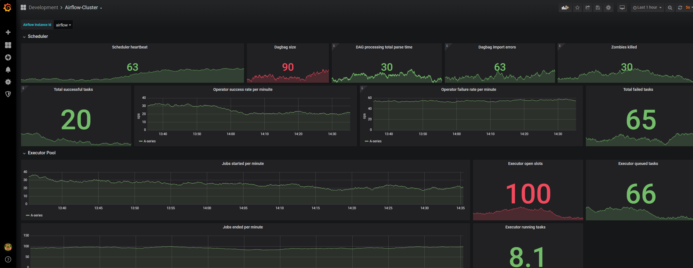
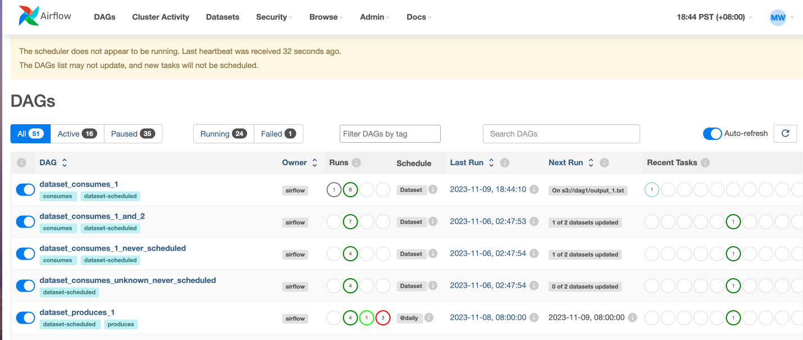

# Docker Airflow
Apache Airflow is an open-source workflow management platform for data engineering pipelines. It is designed to programmatically author, schedule, and monitor workflows. Airflow is one of the best data orchestration. Although for beginners, airflow is hard to setup. The repository will be a template for the author to be used in future developments. Also, roadmaps will be documented for decision-making purposes.

## Objective
- Create a docker-compose for initializing and/or admin accounts (postgre db)
- Create a docker-compose for users (postgre db)
- Create a docker-compose for testing (sqlite db) 

<!-- GETTING STARTED -->
## Getting Started
For every development, the author almost always use containerize environment for its portability. The objective it has to be portability in different environments.

### Prerequisites
- Install the latest docker in your local machine.

### Installation
Initializing your airflow docker environment. If developer and/or admin:
```sh
   docker compose -f "docker-compose.yaml" up -d --build
   ```
If non-technical users:
```sh
   docker compose -f "docker-compose.users.yaml" up -d --build
   ```
If test environment:
```sh
   docker compose -f "docker-compose.tests.yaml" up -d --build
   ```
Navigate inside your browser.
```sh
   http://localhost:8080
   ```

<!-- ROADMAP -->
## Roadmap
The followings tasks is in consideration of low-cost development, but highly-scalable.
- [x] Setup Dockerfile and docker-compose.
- [x] Create a test airflow environment, with Docker.
- [x] Create a production airflow environment, with Docker.
- [x] Connect metadatabase to cloud postgres. (Free Version - Neon Tech Postgres.)
- [ ] Connect metadatabase to AWS, Azure or GCP cloud. (Paid Version, if operations are high)
- [x] Connect Airflow with Grafana, Prometheus and Statsd.
- [x] Setup Grafana with Airflow.
- [ ] Setup Grafana Visualization (JSON file)
- [ ] Setup Grafana cloud connection. (if operations are high)

<!-- Images and/or Diagrams -->
## Diagrams and/or Images



<!-- REFERENCES -->
## References
* [MaxcoTec Learning](https://www.youtube.com/watch?v=xyeR_uFhnD4)
* [Airflow Documentation](https://airflow.apache.org/docs/apache-airflow/2.7.3/docker-compose.yaml)
